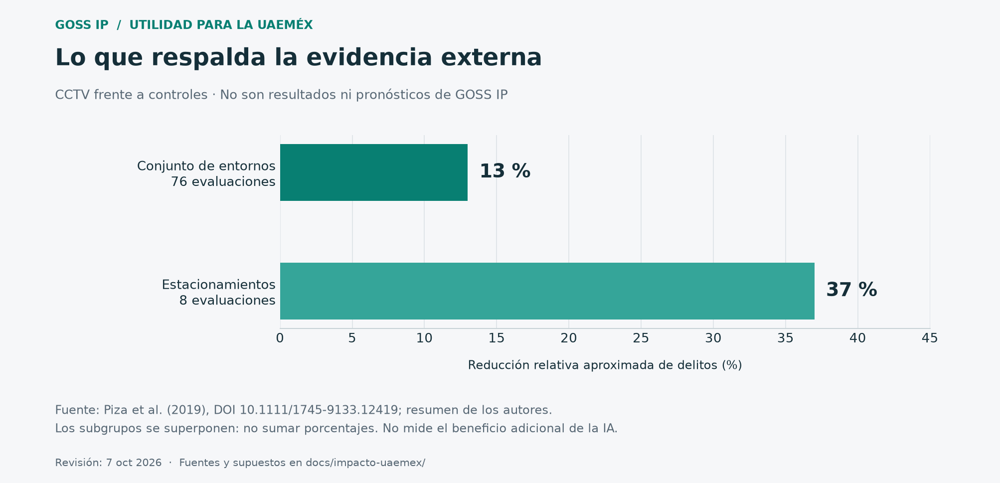
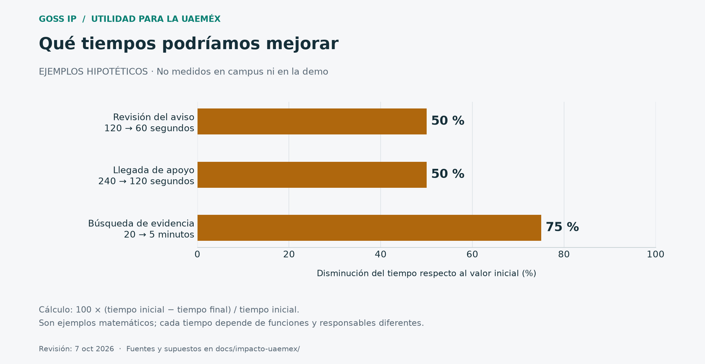
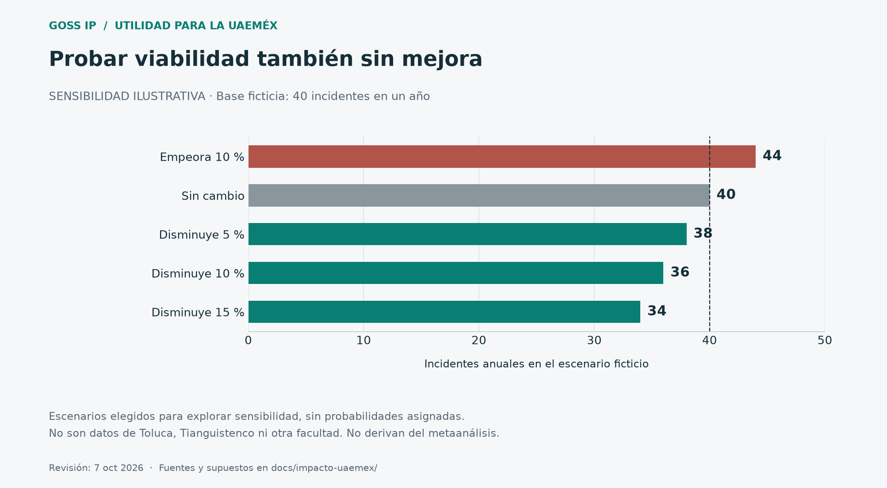

# Utilidad de GOSS IP para la UAEMéx: evidencia y evaluación

Revisión: **7 de octubre de 2026**. Código observado inicialmente: `fe0a98b`, más cambios locales presentes. Se añadió una revisión estática puntual de canalizaciones y ficha de evidencia de `df6112a`, documentada en los hallazgos para Claude; no constituye una validación de todos los commits concurrentes. Investigación de Codex para revisión conjunta con Claude y la profesora.

**Situación confirmada por el equipo:** no existe prueba en un campus ni autorización institucional verificada para tratar placas o rostros. La demostración prevista utiliza las dos cámaras del equipo y una lista de prueba. Los resultados universitarios están **sin medir**, no en cero.

## Decisión que sí se puede defender

GOSS IP tiene una hipótesis útil: convertir ciertas detecciones en avisos revisables, con cámara, hora y evidencia, para ayudar a una persona responsable a atenderlas. Primero debe demostrar esa cadena con dos cámaras; después, si se autoriza, comparar su desempeño con la operación existente en una zona concreta. Comprar cámaras o reconocer una placa no demuestra por sí mismo que bajaron los delitos.

No se recomienda prometer que mejorará la seguridad «sí o sí»: la mejora debe ser el criterio para continuar, corregir o detener el proyecto. La alternativa de iluminación, mantenimiento, personal, protocolos y canales de auxilio debe competir por el mismo presupuesto.

Documentos de trabajo:

- [Delimitación de la lista y responsabilidades](lista-de-seguimiento.md).
- [Protocolo para las dos cámaras y piloto futuro](protocolo-medicion.md).
- [Hallazgos para Claude y pendientes de implementación](revision-para-claude.md).
- [Fuentes verificadas y límites de uso](fuentes.md).
- [Gráficas y cálculos reproducibles](graficas/): se regeneran con `venv\Scripts\python.exe docs/impacto-uaemex/generar_graficas.py`, desde la raíz.

## 1. Qué porcentajes respalda la literatura

| Resultado externo | Magnitud aproximada | Qué permite decir |
|---|---:|---|
| CCTV, conjunto de entornos | 13 % menos delitos frente a controles | Referente internacional, no pronóstico UAEMéx |
| CCTV en estacionamientos | 37 % menos delitos frente a controles | Justifica estudiar esta aplicación, no prometer 37 % aquí |

Piza y colaboradores (2019) sintetizan 76 evaluaciones con datos para metaanálisis; ocho corresponden a estacionamientos. El artículo no encontró un efecto estadísticamente significativo agregado en delitos violentos. Las intervenciones con monitoreo activo y medidas complementarias tuvieron mejores resultados. La evidencia estudia CCTV y estrategias de operación, **no valida GOSS IP ni cuantifica el beneficio adicional de su IA**. Los porcentajes no se suman ni constituyen límites superior/inferior para un campus. [Estudio y resumen de los autores, F1–F2](fuentes.md).

Una revisión de 2025 sobre miedo al delito encontró resultados inconsistentes en 15 estudios. La percepción debe medirse por separado; no se promete que más cámaras hagan sentir más segura a toda la comunidad. [F3](fuentes.md).

## 2. Aplicación territorial: dónde podría aportar

La unidad de evaluación debe ser una **zona, función y turno**, no toda una universidad. «CU de Toluca» se entiende aquí como Ciudad Universitaria/Cerro de Coatepec; no incluye automáticamente todos los espacios UAEMéx de Toluca. En Tianguistenco se usa la denominación Centro Universitario del informe institucional, aunque su sitio conserva referencias a UAP.

| Lugar candidato, pendiente de autorización | Aplicación a evaluar | Beneficio verificable | Condiciones y exclusiones |
|---|---|---|---|
| Acceso vehicular de CU Toluca | Avisar de una placa de seguimiento autorizada | Menor tiempo hasta revisión; proporción de pasos correctamente leídos | Carril y lente adecuados, operador disponible; la placa no identifica al conductor |
| Estacionamiento de CU Toluca | Contexto visual y evidencia de incidentes reportados | Menor tiempo de búsqueda; más casos con evidencia útil | LPR en acceso y vista general cumplen funciones distintas; no afirmar detección de todo robo |
| Acceso/estacionamiento de CU Tianguistenco | Misma cadena en un área acotada | Coincidencias verificadas y continuidad de servicio | Inventario, iluminación, horarios y línea base propios; no trasladar cifras de Toluca |
| Acceso restringido de una facultad | Zona y horario, sin identificar rostros | Menor tiempo de aviso y verificación de entrada fuera de horario | Excepciones para mantenimiento y actividades autorizadas; intrusión geométrica no prueba un delito |
| Pasillo o zona común autorizada | Aviso de caída o incidente visible, si el detector se valida | Tiempo hasta verificación/solicitud de ayuda | Protección Civil define actuación; no diagnóstico médico ni interpretación de intenciones |
| Cámaras de cualquier sede | Supervisión de caída y recuperación | Menos horas de cámara inoperante sin atender | Mantenimiento, energía y enlace; aviso de falla no repara el equipo |
| Entorno exterior, paraderos y trayectos | Coordinación institucional, iluminación y auxilio | Continuidad de la atención y tiempo de canalización | Las dos cámaras no cubren la ruta ni autorizan vigilancia de vía pública |

El informe de Tianguistenco reporta **1,736 estudiantes en 2025–2026** y oferta en Software, Ciberseguridad y Seguridad Ciudadana. Es una oportunidad de colaboración académica, no una cifra de personas ya protegidas. [Informe, p. 16 impresa; F4](fuentes.md). No se verificó un inventario vigente de cámaras, incidentes o tiempos de respuesta de ese campus.

La UAEMéx ya tiene antecedentes normativos de un C2 y diagnósticos de videovigilancia; existen solicitudes institucionales de mejora de cámaras e iluminación. El proyecto debe investigar cómo integrarse a esa operación. Una norma de 2019 no confirma capacidad, organigrama ni conectividad actuales. [F5–F7](fuentes.md).

**Prioridad provisional:** elegir un acceso vehicular y su entorno por necesidad documentada, campo visual viable, responsable y posibilidad de medir. No declarar a Toluca o Tianguistenco «más peligroso» sin datos comparables.

## 3. Qué debería bajar y qué debería subir

Todas las metas de esta tabla son **propuestas a acordar**, no resultados existentes ni estándares normativos.

| Indicador | Dirección deseable | Cómo se mide | Límite de interpretación |
|---|---|---|---|
| Tiempo incidente → aviso visible | Bajar | Reloj de observador y recepción en dashboard; mediana y p95 | El timestamp emitido por el worker puede comenzar después del hecho |
| Tiempo aviso → primera revisión | Bajar | Marcas separadas de entrega y revisión | El campo actual `acknowledged_at` no separa todo el flujo |
| Tiempo aviso → llegada de apoyo | Bajar | Confirmación del equipo que llega | Depende de personal, distancias y protocolo; hoy falta captura estructurada |
| Tiempo de localizar evidencia | Bajar | Tareas equivalentes, con y sin GOSS IP | Comparar con el CCTV/NVR real existente, no con una situación ficticia sin tecnología |
| Horas de cámara fuera de servicio | Bajar | Caída, aviso, ticket y recuperación | Separar mantenimiento programado e imprevisto sin ocultar indisponibilidad total |
| Incidentes confirmados por 10,000 entradas | Bajar | Registro independiente + aforo del mismo lugar y periodo | No usar número de alertas como número de delitos |
| Proporción de incidentes con evidencia útil | Subir | Revisión con rúbrica acordada y muestra trazable | Un archivo existente no garantiza identificación ni admisibilidad jurídica |
| Disponibilidad de la cadena completa | Subir | Minutos funcionales cámara→worker→API→operador / minutos requeridos | Un `/health` exitoso no acredita detección ni notificación |
| Sensibilidad y precisión de coincidencias | Subir | Verdad de referencia, aciertos, fallos y falsas alertas | Incluir pasos no detectados; no evaluar solo recortes exitosos |
| Cobertura efectiva | Subir | Puntos prioritarios probados / puntos priorizados | No equivale al porcentaje de campus bajo observación |
| Confianza, conocimiento de canales y trato digno | Subir | Encuesta voluntaria comparable y revisión cualitativa | Vigilar también incomodidad, exclusión y quejas de privacidad |

**Un indicador puede subir y ser buena noticia:** al mejorar detección o confianza pueden aumentar los reportes de acoso, incidentes o fallos. Reducir denuncias nunca debe ser una meta. Separar hechos ocurridos, hechos reportados, detecciones automáticas y alertas confirmadas.

## 4. Porcentajes ilustrativos que se pueden calcular hoy

Estos números explican el método; **ninguno fue observado en los campus ni en la demo prevista**.

| Ejemplo hipotético | Antes | Después supuesto | Resultado matemático |
|---|---:|---:|---|
| Primera revisión de un aviso | 120 s | 60 s | 50 % menos tiempo |
| Llegada de apoyo | 240 s | 120 s | 50 % menos tiempo |
| Búsqueda de evidencia | 20 min | 5 min | 75 % menos tiempo |
| Casos con evidencia útil | 12/20 = 60 % | 18/20 = 90 % | +30 puntos porcentuales; aumento relativo de 50 % |

Fórmula de disminución: `100 × (antes − después) / antes`. Si antes es cero, el porcentaje relativo no está definido. Para proporciones, informar también la diferencia en puntos porcentuales y ambos denominadores.

Para explorar viabilidad sin fingir predicción, el escenario de **40 incidentes anuales ficticios** permite contrastar reducción de 0, 5, 10 o 15 % y un deterioro del 10 %. Los resultados serían 40, 38, 36, 34 y 44 incidentes respectivamente. La elección de esos valores es una sensibilidad matemática, sin probabilidades asignadas; no procede del 13 % o 37 % del metaanálisis. Sirve para preguntar si la intervención aún compensa si el efecto es pequeño, nulo o adverso.

No multiplicar estudiantes × porcentaje de reducción para calcular «alumnos salvados». Para contar beneficiarios directos hay que verificar quiénes usan el área cubierta y evitar duplicar personas entre cámaras, turnos y facultades.

## 5. Evaluación causal: cómo saber si fue el sistema

1. Registrar previamente un resultado principal, por ejemplo tiempo hasta verificación, y separar incidentes por tipo, zona y horario.
2. Medir la operación existente. Para resultados delictivos, solicitar preferentemente 12–24 meses de registros comparables; para operación, una línea base de varias semanas con turnos suficientes. Son propuestas de diseño, no garantía de potencia estadística.
3. Comparar con zonas similares que mantengan su servicio de seguridad. Si es viable, sortear el orden de activación entre zonas elegibles. No retirar protección existente para construir un control.
4. Mantener definiciones, fuentes y aforos; registrar cambios en matrícula, iluminación, patrullaje, vacaciones, actividades extraordinarias y otros factores. Comparar los mismos periodos académicos.
5. Evaluar la combinación de cámaras y protocolo frente al servicio habitual. Para afirmar el valor de la **IA**, comparar además con CCTV y personal equivalentes, variando solo el apoyo analítico cuando sea viable.
6. Revisar zonas contiguas: que un problema se mueva fuera del campo visual no es una reducción total. Tratar cada incidente como uno aunque lo vean varias cámaras.
7. Reportar intervalos de confianza, faltantes y efectos adversos. El tamaño muestral debe calcularse con tasa basal, efecto mínimo útil y agrupación por zona; dos cámaras no permiten demostrar un efecto delictivo institucional.

Ejemplo ficticio con exposiciones iguales: zona intervenida pasa de 40 a 34 incidentes; control de 50 a 45. La reducción bruta es 15 %, pero el cociente de cambios es `(34/40)/(45/50) = 0.9444`, equivalente a **5.6 % de reducción relativa ajustada**. Este estimador descriptivo requiere tendencias comparables; no garantiza causalidad. Con esos conteos, un intervalo aproximado Poisson del 95 % para la reducción sería de **−73.7 % a +48.6 %**, por lo que el ejemplo no acredita mejora. Es solo ilustrativo: el análisis real debe manejar exposición, dependencia y sobredispersión.

ENSU describe percepción de adultos en áreas urbanas; SESNSP aporta delitos registrados por autoridades. Ninguna es una línea base directa del campus. Usar INEGI/SESNSP para contexto y tendencias externas, con fecha, geografía y metodología, nunca como «porcentaje de alumnos afectados». Revisar comparabilidad de las series 2015–2025 frente a la metodología publicada para 2026. [F8–F9](fuentes.md).

## 6. Costos, operación y alternativas

No hay cotización institucional ni retorno financiero demostrado. Elaborar el **costo incremental frente a aprovechar el sistema actual**:

- Inversión: levantamiento, adecuación/reuso de cámaras, lentes, cableado, PoE, cómputo, almacenamiento, UPS, integración, formación y revisión jurídica.
- Operación: personal que verifica, mantenimiento, conectividad, energía, soporte, respaldos, renovación de licencias/modelos y evaluación periódica.
- Fallos: tiempo improductivo, falsas alertas, revisión de coincidencias erróneas, reposición y costos de incidentes de seguridad informática.
- Continuidad: responsable que pueda operar y mantener la instalación cuando se gradúe el equipo; manual, presupuesto y transferencia de conocimiento.

`TCO a 3 años = inversión incremental + suma de operación y reposición de 3 años`.
`Costo por cámara-hora útil = costo del periodo / horas verificadas de servicio útil`.
`Costo por caso revisado útil = costo del periodo / casos que cumplen la rúbrica`.

Las horas liberadas son capacidad reasignable; solo son ahorro de caja si disminuye un gasto efectivo. No contar dos veces daños evitados, indemnizaciones y aseguramiento del mismo incidente. Para rentabilidad, valorar únicamente beneficios locales defendibles, mostrar el escenario sin reducción delictiva y considerar el presupuesto de mantenimiento. No asignar precio a vidas «salvadas» con la demo.

Comparar cuatro alternativas: mantenimiento/iluminación/protocolos; CCTV existente mejor operado; GOSS IP en un acceso; expansión multinodo. Elegir por beneficio marginal, riesgos y costo, no por cantidad de funciones de IA.

## 7. Viabilidad técnica y institucional

Las mediciones del proyecto son ensayos cortos en una laptop, con configuraciones distintas. [Evidencias internas](../evidencias/README.md) registran diferencias entre uno y varios procesos y una muestra breve con dos cámaras reales. No sustentan «8–16 cámaras por GPU», disponibilidad 24/7 ni latencia integral. La atribución del límite al GIL debe tratarse como diagnóstico a confirmar con perfilado, no como causa probada solo por observar bajo uso de GPU.

Antes de dimensionar: medir tráfico real día/noche, carga concurrente, degradación de red, ocupación de disco, recuperación y alertas simultáneas. Una cámara panorámica puede servir para contexto y no para leer placas. GOSS IP conserva eventos y clips; no sustituye automáticamente un NVR con grabación continua. Congelar versión/modelos/umbrales durante la evaluación y documentar cualquier cambio.

La autorización debe definir responsable, finalidad, zonas, tipos de datos, accesos, plazos y respuesta a incidentes. El marco para una universidad pública no se resuelve citando solo la ley para particulares. La legislación general de sujetos obligados y la estatal, junto con las disposiciones universitarias aplicables, requieren revisión de la instancia competente. Verificar además si procede evaluación de impacto antes del despliegue. [F10–F12](fuentes.md). El aviso de SOS existente no autoriza por sí mismo a GOSS IP.

Revisar licencias del software y de cada peso de modelo antes de distribución o uso institucional; no basta «es educativo». [Pendientes de licencias](../licencias.md) requiere revisión específica del despliegue, no afirmaciones generales sobre todo uso interno.

Propuesta de gobierno: responsable operativo de seguridad; enlace TI; unidad de transparencia/protección de datos y asesoría jurídica; Protección Civil; representación estudiantil y de personal; evaluación académica independiente del desarrollador. Registrar incidentes de privacidad, inequidad y trato indebido con el mismo rigor que los beneficios.

## 8. Información que falta y cómo obtenerla

| Información | Quién podría confirmarla | Uso y formato mínimo |
|---|---|---|
| Finalidad, competencias y autorización | Instancia jurídica y responsable de datos | Dictamen/documento institucional; no permisos supuestos |
| Cámara/NVR, red, energía y soporte existentes | TI y seguridad de la sede | Inventario técnico restringido; no publicar credenciales o mapas de puntos débiles |
| Incidentes por tipo, zona y turno | Seguridad y responsables de atención | Agregados mensuales de 12–24 meses; criterio de registro y faltantes |
| Aforo y horarios | Administración y operación | Entradas o vehículos por periodo, no solo matrícula |
| Secuencia de atención | Operadores/guardias | Tiempos de aviso, revisión, despacho, llegada y cierre; causas de demora |
| Evidencia disponible y tiempo de búsqueda | Operadores autorizados | Muestra desidentificada y tareas comparables |
| Necesidades de estudiantes y personal | Consulta voluntaria y representación | Encuesta con instrumento estable, tasa de respuesta y análisis de no respuesta |
| Costos y capacidad de mantenimiento | Administración/TI | Cotizaciones fechadas y costos internos aprobados |

Texto para solicitar información, **no enviado**: «Para evaluar un piloto acotado de apoyo a videovigilancia, solicitamos confirmar responsable y procedimiento de autorización, inventario compatible y registros agregados de incidentes y atención por zona/turno, sin nombres, placas, rostros ni expedientes individuales. La propuesta no presupone permiso para reconocimiento facial ni acceso a bases externas».

## 9. Qué puede presentarse a la profesora

> Buscamos mejorar la capacidad de advertir y revisar eventos relevantes, empezando por una demostración controlada con dos cámaras. La literatura apoya estudiar la videovigilancia en determinados entornos, pero todavía no hemos medido su impacto en la UAEMéx. Proponemos demostrar primero precisión, tiempos y trazabilidad, y después solicitar un piloto autorizado que compare el servicio actual con GOSS IP. La lista genera avisos para revisión humana, no juicios sobre personas.

El siguiente resultado útil es una ficha completa por ensayo y una decisión de continuar basada en datos. La expansión a CU Toluca, Tianguistenco o facultades queda condicionada a necesidad local, autorización, operación sostenible y beneficio demostrado.
