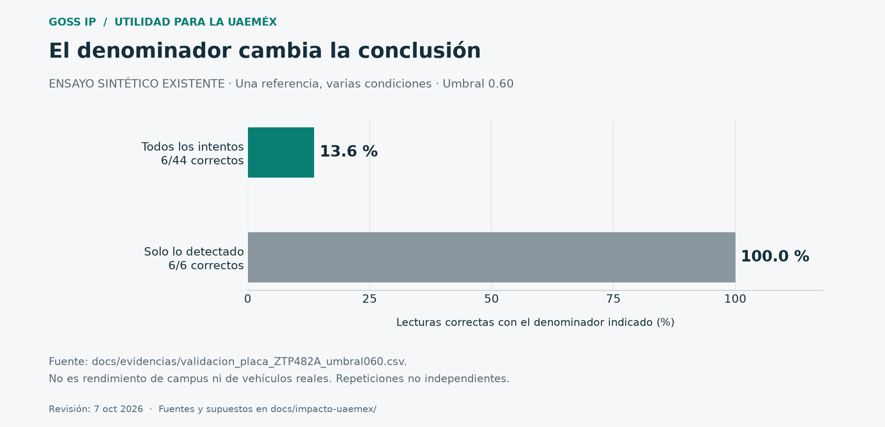

# Cómo demostrar utilidad sin inventar resultados

**Estado al 7 de octubre de 2026:** protocolo preparado, todavía no ejecutado. No se encendieron cámaras, modificaron listas, consultaron bases reales ni borraron datos durante esta investigación.

## A. Ensayo controlado con las dos cámaras

### Preparación

Asignar C1 y C2 a zonas cerradas de prueba. Ambas deben probar positivos y negativos; no dejar una cámara exclusivamente para «aciertos». Mantener una hoja de verdad de referencia, preparada antes del ensayo, con ID de objetivo y resultado esperado. Un observador distinto del operador registra los pasos.

Antes de ejecutarlo, el equipo debe verificar una instancia o configuración separada con base, capturas, clips y spool propios: no basta cambiar el ID de cámara o el `.env` del worker si ambos apuntan a la misma API. Confirmar que el alta no reescanea historial real. Esta separación es un requisito del ensayo propuesto, **no una función nueva instalada por este informe**.

Usar referencia positiva, referencia negativa claramente distinta y referencia parecida para probar ambigüedad. El objeto impreso y su código solo identifican un ejercicio. Configurar prioridad de demostración sin implicar gravedad real. Notificaciones externas apagadas salvo ensayo específico en un canal propio autorizado, sin datos ajenos.

Registrar versión, umbrales, distancia, ángulo, iluminación, tamaño del objetivo, configuración de cada cámara y detectores activos. La configuración de ejemplo tiene rostros activos: revisar ambas cámaras y desactivarlos en la demo de placas. No dar por hecho que ya se cambió la configuración.

### Secuencia breve, mostrando todos los intentos

| Caso | Acción | Criterio observable |
|---|---|---|
| 1 | Mostrar referencia positiva antes del alta | Puede existir detección/evento; no debe atribuir coincidencia con una lista vacía |
| 2 | Alta de esa referencia por administrador | Registro con motivo de ensayo, autor y vencimiento; marcar hallazgos retroactivos por separado |
| 3 | Pasarla por C1 y luego por C2 | Aviso de la cámara correcta, lectura, referencia y tiempo; no interpretar dos cámaras como dos incidentes |
| 4 | Pasar referencia negativa | No alertar por esa lista; otras reglas activas se evalúan por separado |
| 5 | Pasar referencia parecida | Evaluar lectura/comparación, mostrar incertidumbre y revisión; no exigir a ciegas `fuzzy` porque existe normalización |
| 6 | Baja y repetición | No generar una nueva coincidencia por el registro desactivado; comprobar invalidación de caché |
| 7 | Vencimiento y repetición | No generar nueva coincidencia por referencia expirada |
| 8 | Consultor intenta dar de alta o modificar | Acceso rechazado; no basta esconder un botón |
| 9 | Corte y recuperación de C1 | Aviso y recuperación; C2 continúa, registrando cualquier degradación |
| 10 | Dos pasos simultáneos y revisión | No perder la relación cámara–evidencia; medir demoras y carga del operador |

No escenificar agresiones, uso de armas o emergencias reales para esta demo. El alcance confirmado es coincidencia con la lista de prueba. Si se añade biometría voluntaria, requiere un bloque y resultados separados.

### Muestra y métricas

Una demostración rápida puede incluir **10 oportunidades positivas y 10 negativas por cámara** (40 observaciones de cámara en total). Es una propuesta logística, no tamaño suficiente para validar operación universitaria. Si los mismos objetivos recorren ambas cámaras, las observaciones están relacionadas; no inflar la muestra contando frames como ensayos independientes.

Para un ensayo técnico posterior más amplio, proponer al menos 60 positivos y 60 negativos por cámara, distribuidos entre condiciones, con referencias distintas; calcular después el tamaño requerido para la precisión deseada. Repetir una impresión 60 veces no demuestra generalización a 60 matrículas. Mantener aparte un conjunto que no se use para ajustar umbrales.

- `TP`: oportunidad positiva con aviso correcto dentro del plazo definido.
- `FN`: positiva sin aviso correcto a tiempo, aunque el sistema no haya detectado nada.
- `FP`: oportunidad negativa con aviso de coincidencia; contar también avisos extra fuera de oportunidades y reportarlos por cámara-hora.
- `TN`: negativa sin aviso de coincidencia.
- Sensibilidad de extremo a extremo: `TP/(TP+FN)`.
- Precisión de avisos: `TP/(TP+FP)`.
- Tasa de falsa alarma entre negativos: `FP/(FP+TN)`; no confundirla con `FP/(TP+FP)`.
- Lectura exacta por paso: lecturas correctas / todos los pasos previstos, incluidos los no detectados. Reportar también OCR condicionado a detección, con ese nombre.
- Latencia completa: primera aparición definida del objetivo → aviso visible. Si el diseño emite al salir el vehículo, medir además salida → aviso y explicarlo.
- Tiempo de operador: entrega → revisión efectiva. Un clic de cierre posterior no equivale a llegada ni resolución del incidente.

La precisión depende de cuántos positivos hay: un ensayo 50/50 no representa una operación con coincidencias raras. Ejemplo ficticio de 10,000 pasos: 10 positivos, 90 % de sensibilidad y 1 % de falsas alarmas entre los 9,990 negativos darían aproximadamente 9 avisos verdaderos y 100 falsos, apenas **8.3 % de precisión**. No es rendimiento medido del proyecto; muestra por qué deben evaluarse la carga y la frecuencia real.

Con 20 negativos independientes y cero errores, la tasa observada es 0 %, pero el límite superior unilateral exacto de 95 % sería `1 − 0.05^(1/20) ≈ 13.9 %`. La dependencia entre ensayos limita incluso esa interpretación. No presentar «cero errores» como garantía.

### Ficha por oportunidad (campos propuestos)

`sesion_id`, `ensayo_id`, `camara`, `referencia_ensayo`, `esperado`, `version`, `umbral`, `condicion`, `vigencia_registro`, `t_aparicion`, `t_salida`, `t_aviso_visible`, `t_revision`, `resultado`, `lectura_correcta`, `archivo_evidencia_controlado`, `motivo_error`.

Usar relojes sincronizados, UTC para almacenamiento y hora local etiquetada para presentación. Distinguir ausente, no aplicable y cero; no completar valores faltantes con cero. Con muestras pequeñas, publicar todos los tiempos o mediana/rango y advertir la inestabilidad del p95.

### Puerta de salida de la demo

El ensayo debe mostrar positivos y negativos, baja/vencimiento, origen de cámara y revisión humana; documentar errores y recuperación. Cualquier filtración de datos, alerta real a terceros o coincidencia tratada como acusación interrumpe el ejercicio. Un resultado técnico favorable permite proponer un piloto, no declarar autorización ni reducción delictiva.

## B. Qué enseñan las pruebas ya guardadas

El CSV de escenas generadas con umbral 0.60 contiene 6 lecturas correctas de 44 oportunidades (**13.6 % de extremo a extremo**) y 6/6 correctas entre las detectadas (**100 % condicional**). La gran diferencia muestra por qué hay que incluir fallos de detección. Son escenas sintéticas de una misma referencia, no una evaluación de los campus ni de todas las placas reales. [Archivo de evidencia](../evidencias/validacion_placa_ZTP482A_umbral060.csv).

El resumen histórico tiene 25 lecturas y ninguna corrección manual: eso acredita cero correcciones registradas, no ausencia de errores. Su mediana de atención de 7,800 s corresponde a alertas de prueba revisadas posteriormente; no debe convertirse en línea base operativa UAEMéx ni ocultarse sustituyéndola por una mejora ficticia.

## C. Piloto universitario futuro, solo después de autorización

1. **Diagnóstico:** caso de uso, necesidad, servicio actual, responsable, autorización, información agregada y alternativas. Elegir zona elegible y comparación.
2. **Línea base:** mismas tareas y definiciones antes de intervención; el CCTV y la seguridad existentes siguen funcionando.
3. **Modo de observación controlada:** validar avisos con operador sin decisiones automatizadas sobre personas; revisar errores, carga y protección de datos.
4. **Operación supervisada:** personal capacitado, turnos cubiertos, protocolo de escalamiento y registro independiente de incidentes/atención.
5. **Evaluación:** utilidad, costo incremental y efectos adversos; ampliar, ajustar o detener. La cantidad de cámaras se decide por cobertura funcional y carga medida.

Metas técnicas iniciales **a negociar y validar**, sin valor de certificación: disponibilidad integral ≥99 % del horario pactado; ≥95 % de fichas con campos obligatorios; mejora del 30 % en mediana de revisión sin empeorar p95; sensibilidad ≥95 % en el conjunto de ensayo definido. La tolerancia a falsos avisos debe derivarse del volumen y capacidad de atención, no fijarse solo como porcentaje. No aplicar estas metas a todo tipo de delito o detector.

Gráficas que debe producir un piloto real:

- Serie semanal de incidentes confirmados por exposición, intervención y comparación, con activación y calendario escolar señalados.
- Distribución de tiempos de revisión/llegada, no solo promedio; mostrar alertas no atendidas y tiempos censurados.
- Embudo de oportunidades → detecciones → lecturas correctas → avisos → revisión → actuación documentada.
- Falsos avisos por cámara-hora y tipo, con volumen de trabajo por turno.
- Disponibilidad por cámara y por función, acompañada de tiempo de reparación.
- Evidencia útil y encuesta de confianza/privacidad, con denominadores y tasa de respuesta.
- Costos acumulados y costo por servicio útil frente a alternativas.

No publicar mapas de puntos ciegos, ubicaciones sensibles ni datos individuales en material de difusión. Las gráficas públicas pueden usar zonas agregadas y umbrales mínimos de conteo para evitar identificar personas.
